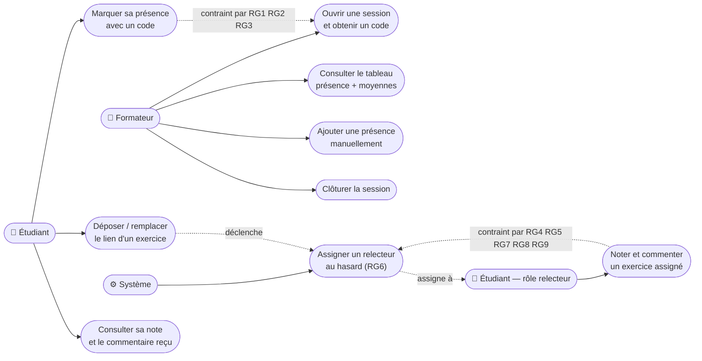

# D1 — Cas d'utilisation

Formalisme : Mermaid `flowchart`

**Notes de lecture**
- Le rôle « Relecteur » n'est pas un compte distinct : c'est un étudiant, désigné automatiquement par
  le système (UC9) parmi les étudiants présents à la session (RG6).
- UC9 est un cas d'usage système, sans interaction humaine directe : il est déclenché par UC3 (dépôt
  d'exercice), voir hypothèse Z5 du cahier des charges.
- UC7 (clôturer la session) est l'action introduite pour combler le trou fonctionnel Z1 — elle
  conditionne RG9, RG11, RG12, RG14.
