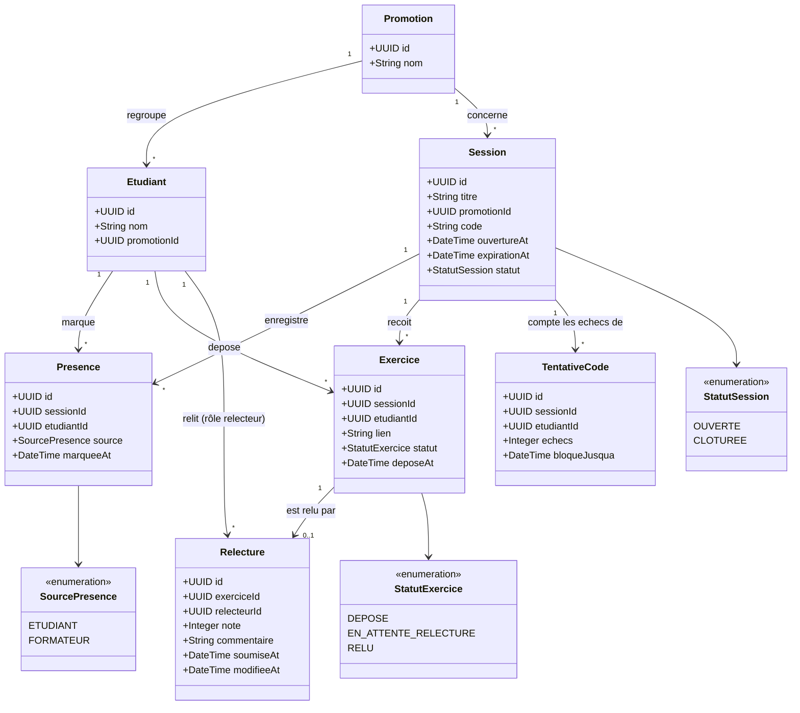

# D2 — Modèle de données (diagramme de classes)

Formalisme : Mermaid `classDiagram`. Suffisamment précis pour être traduit directement en migrations
(types, contraintes d'unicité en commentaire, cardinalités explicites).

**Contraintes portées par ce modèle (à traduire en migrations, étape 2)**
- `Presence` : unicité (`sessionId`, `etudiantId`) → applique RG contre la double présence (EF4).
- `Exercice` : unicité (`sessionId`, `etudiantId`) → un seul exercice actif par étudiant et par session.
- `Relecture` : unicité (`exerciceId`) → un seul relecteur par exercice (RG5) ; `relecteurId` ≠
  `etudiant_id` de l'exercice associé (RG4, à vérifier en base et en service).
- `Relecture.note` : entier, contrainte `CHECK (note BETWEEN 0 AND 20)` (RG8).
- `Session.statut` conditionne, au niveau service, l'écriture sur `Presence`, `Exercice` et `Relecture`
  (RG2, RG9, RG11, RG12, RG14).
- `TentativeCode` porte le compteur d'échecs et la fenêtre de blocage de 2 minutes (RG3, EF5).
